# admin_crud

Run 2026-10-07T16:16:57.466Z against http://127.0.0.1:3000.

| screenshot | user | URL | shows |
|---|---|---|---|
| 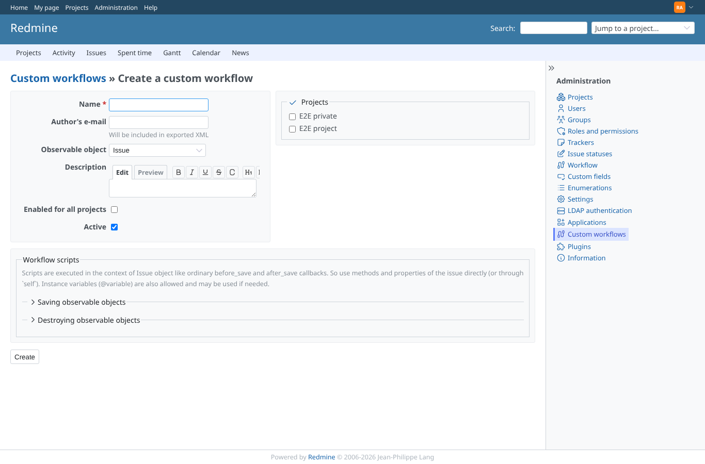 | admin | `/custom_workflows/new` | New workflow form, observable Issue: the save scripts fieldset is closed (angle-right icon) |
| 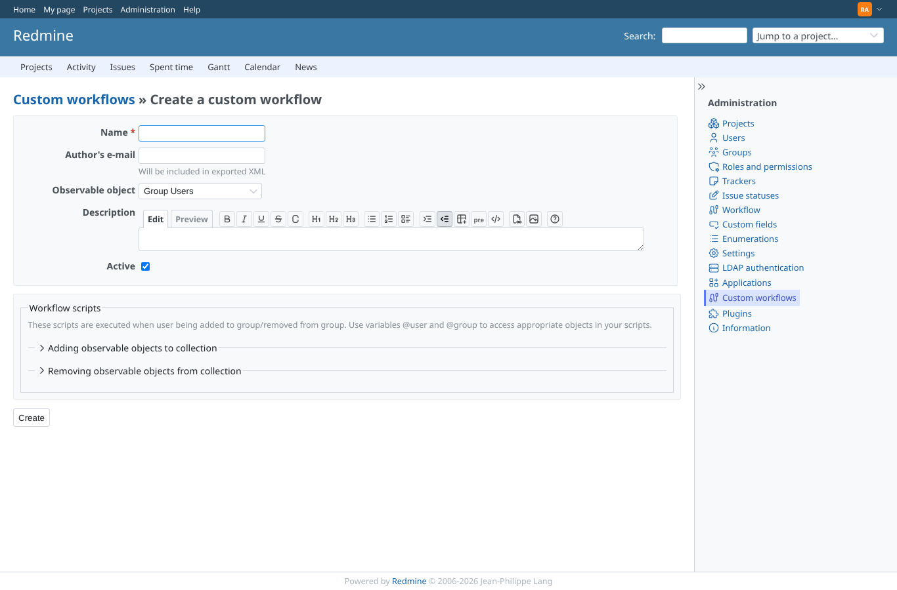 | admin | `/custom_workflows` | After choosing Group Users the form shows the add/remove script fieldsets, nothing saved yet |
| 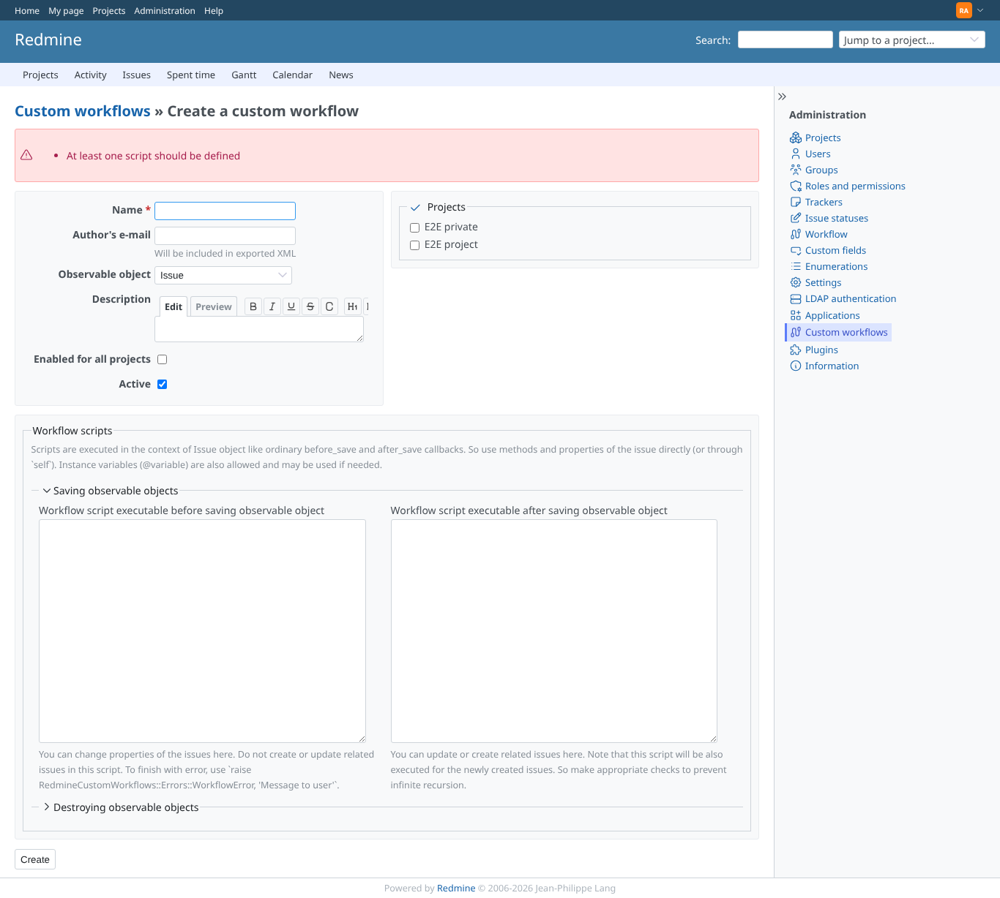 | admin | `/custom_workflows` | Refused: no script filled in (the error opens the save scripts fieldset) |
| 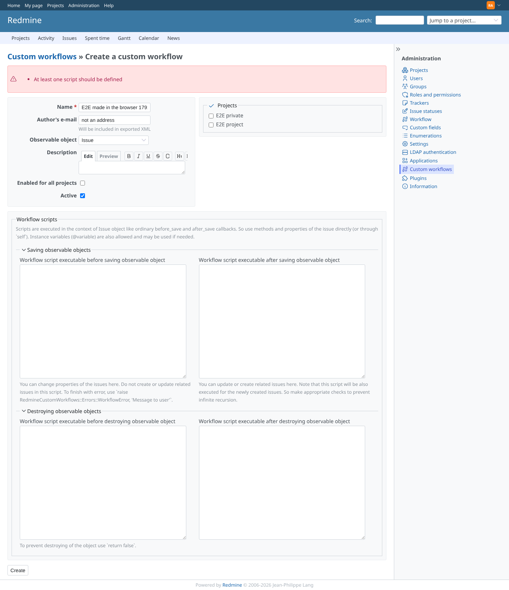 | admin | `/custom_workflows` | Clicking the Destroying legend opens that fieldset and turns its icon to angle-down |
| 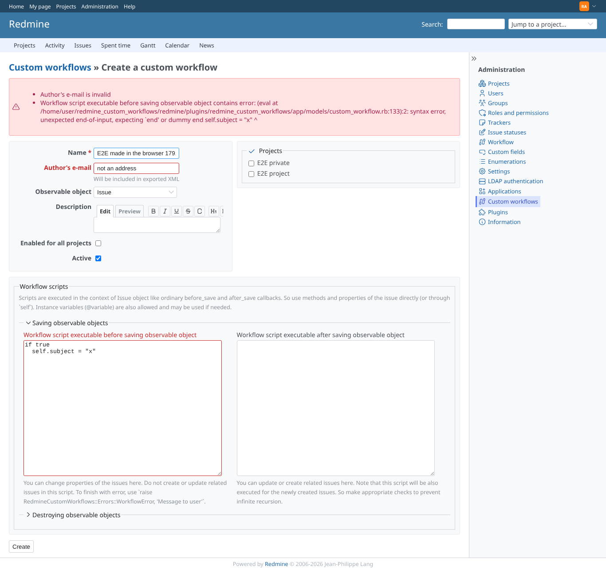 | admin | `/custom_workflows` | Refused: invalid author address and a syntax error in the before_save script |
| 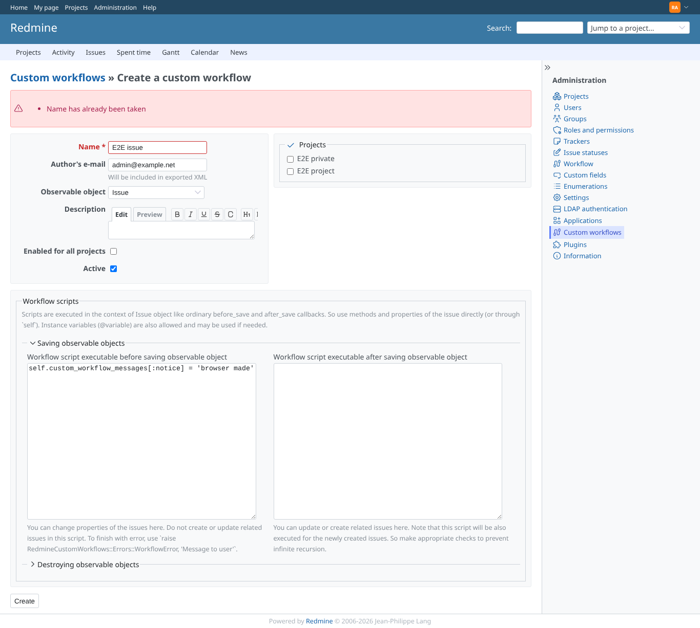 | admin | `/custom_workflows` | Refused: the name is already used |
| 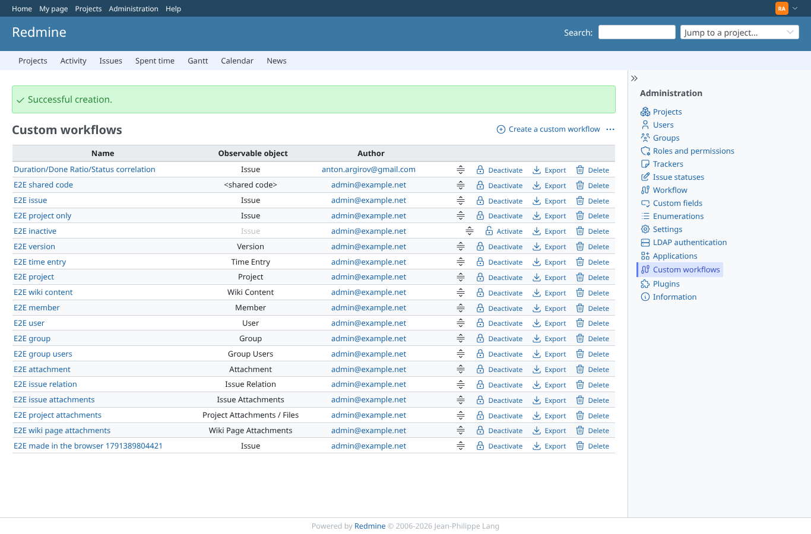 | admin | `/custom_workflows` | Created: flash notice and the new workflow at the bottom of the list |
| 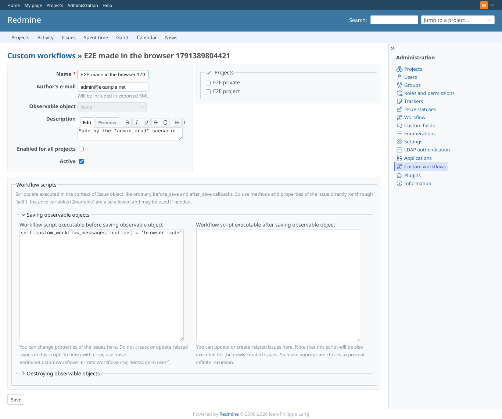 | admin | `/custom_workflows/19/edit` | Edit form: before_save filled so its fieldset is open (angle-down), project list on the right |
| 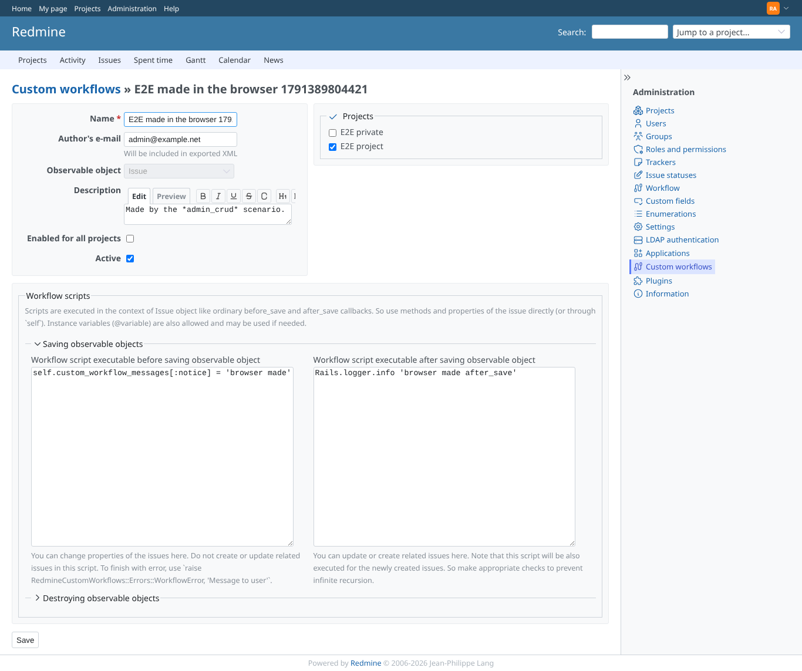 | admin | `/custom_workflows/19/edit` | After saving: one project checked and the after_save script kept |
| 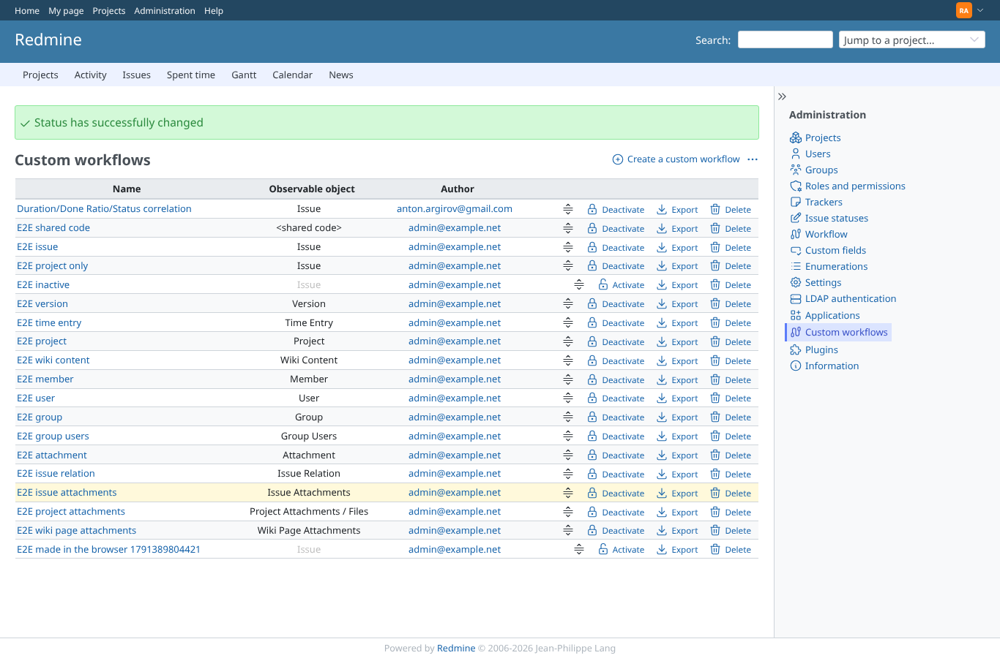 | admin | `/custom_workflows` | Deactivated: the row is greyed and offers Activate |
| 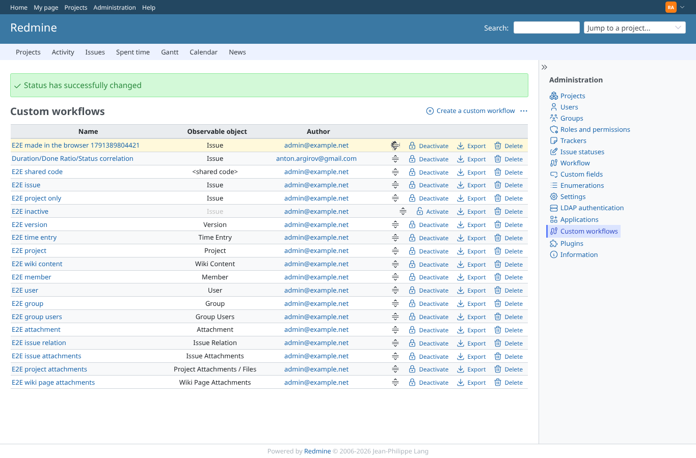 | admin | `/custom_workflows` | Dragged by its handle to the top: the order is saved (the page reloads with the new order) |
| 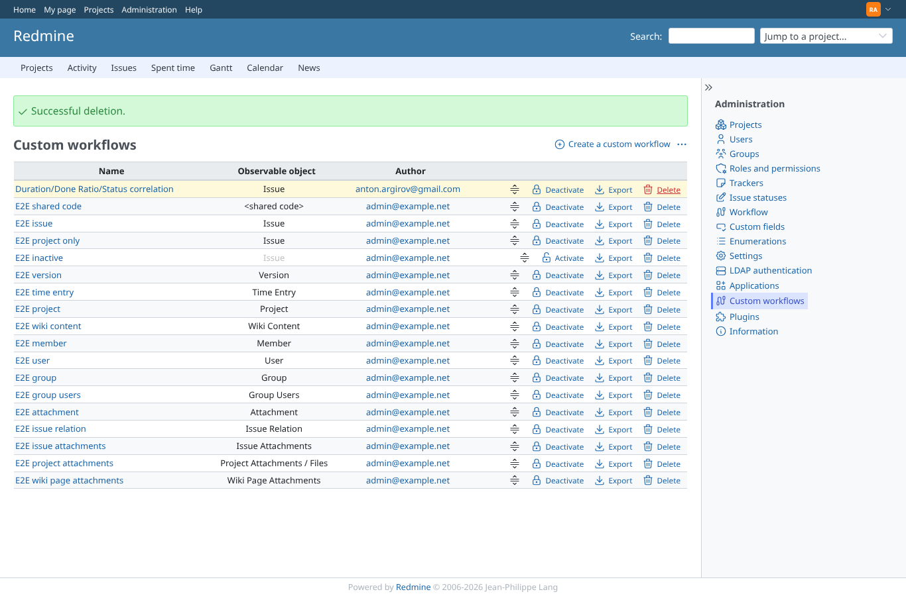 | admin | `/custom_workflows` | Deleted after the confirmation: flash notice, the workflow is gone |
| 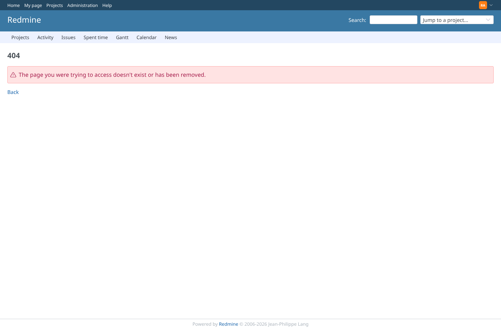 | admin | `/custom_workflows/999999/edit` | A workflow that does not exist answers 404 |
