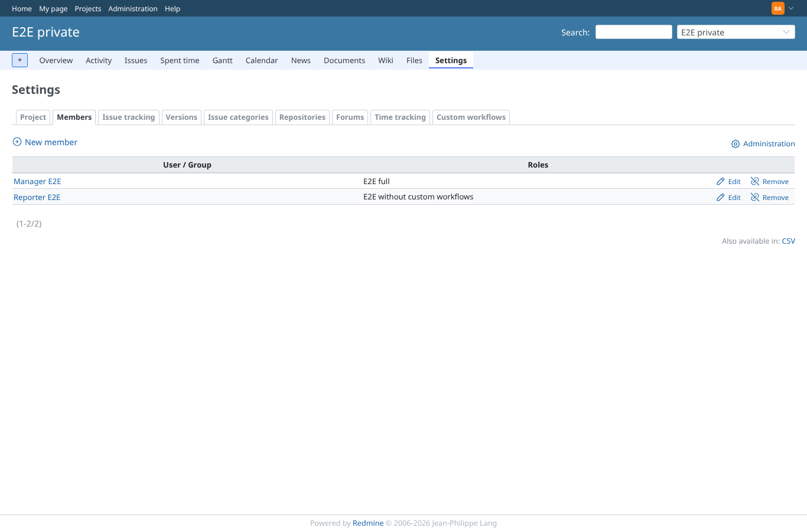
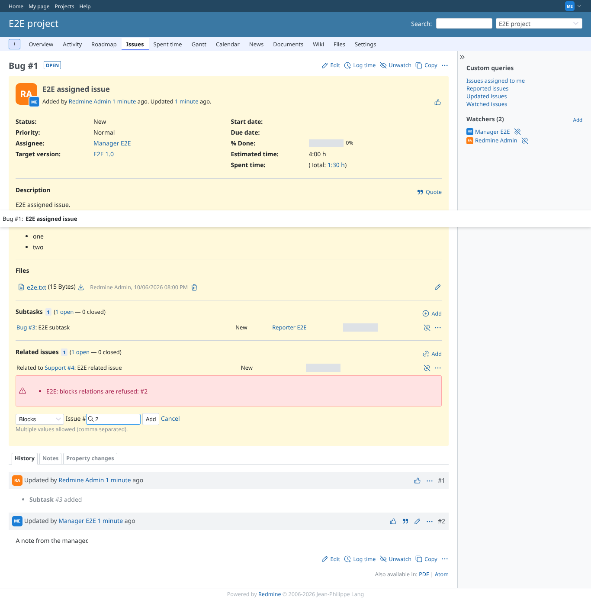
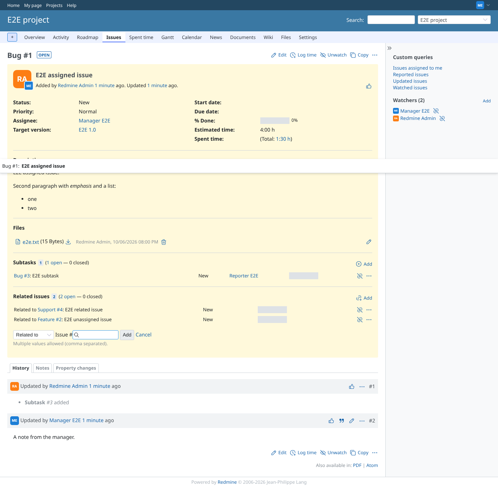
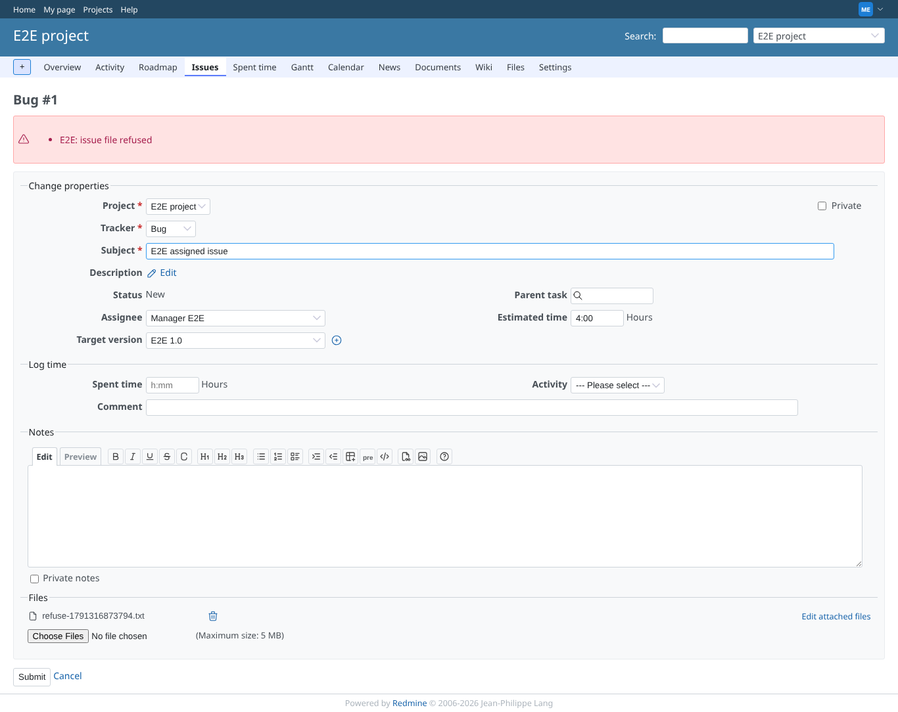
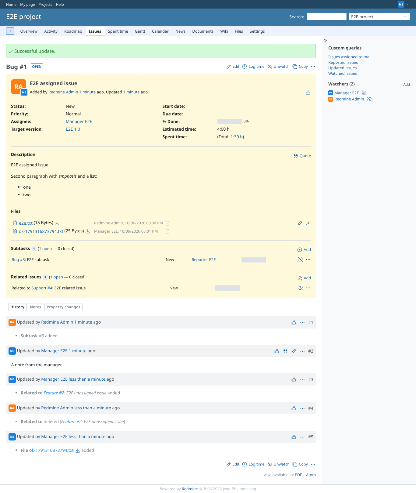
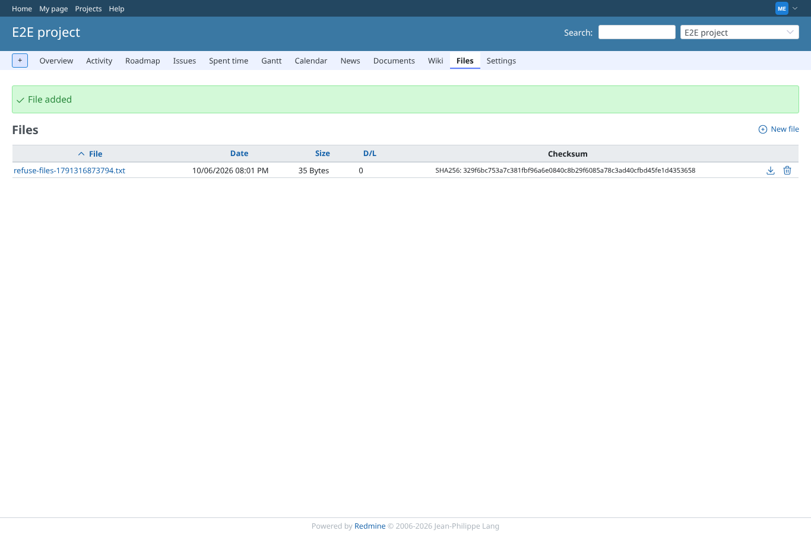
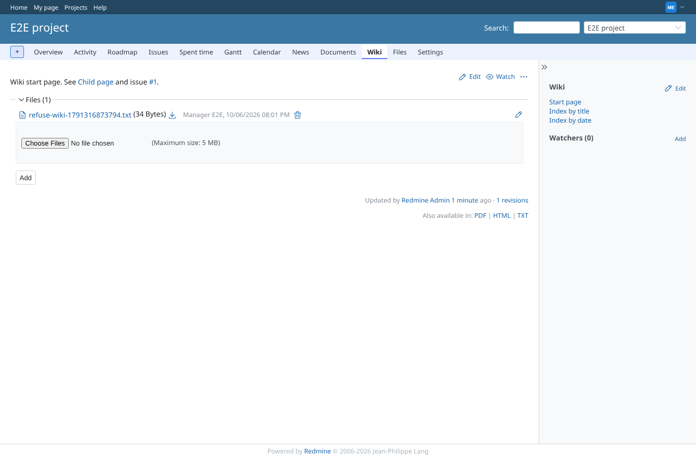
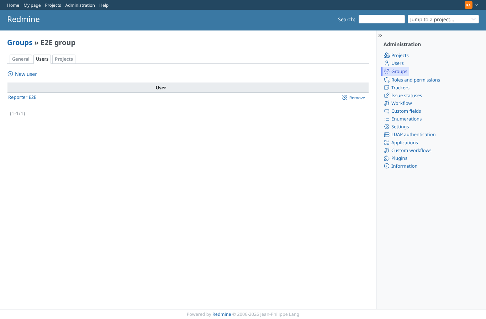

# collections

Run 2026-10-06T20:01:34.849Z against http://127.0.0.1:3000.

| screenshot | user | URL | shows |
|---|---|---|---|
|  | admin | `/projects/e2e-private/settings/members` | Member: the member workflow refuses outsider in e2e-private; the modal closes without a message (core re-validates the member; alert: none) |
|  | manager | `/issues/1` | Issue relation: "blocks" is refused by the issue relation workflow, shown in the relation form |
|  | manager | `/issues/1` | Issue relation: "relates" to #2 is accepted |
|  | manager | `/issues/1` | Issue attachments: before_add refuses refuse-*.txt; the update is not saved and the form shows the error |
|  | manager | `/issues/1` | Issue attachments: another file is attached (after_add logs it) |
|  | manager | `/projects/e2e-project/files` | Project attachments (Files): before_add ran and raised (logged); the file is added anyway |
|  | manager | `/projects/e2e-project/wiki/Wiki` | Wiki page attachments: before_add ran and raised (logged); the file is attached anyway |
|  | admin | `/groups/8/edit?tab=users` | Group users: before_add ran and raised for outsider (logged); outsider is added anyway: a collection callback cannot refuse |
|  | admin | `/groups/8/edit?tab=users` | Group users: reporter is added |
