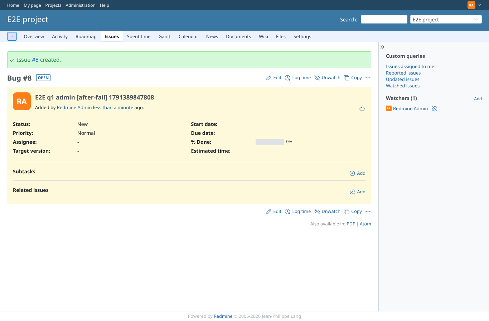
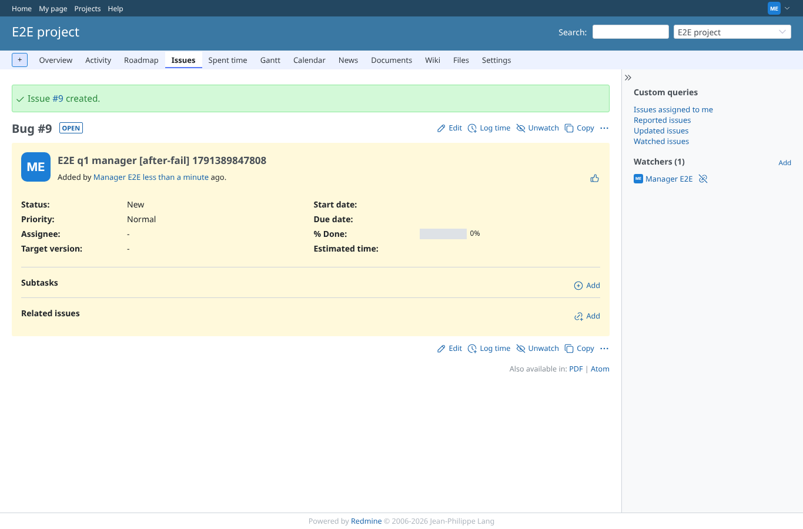
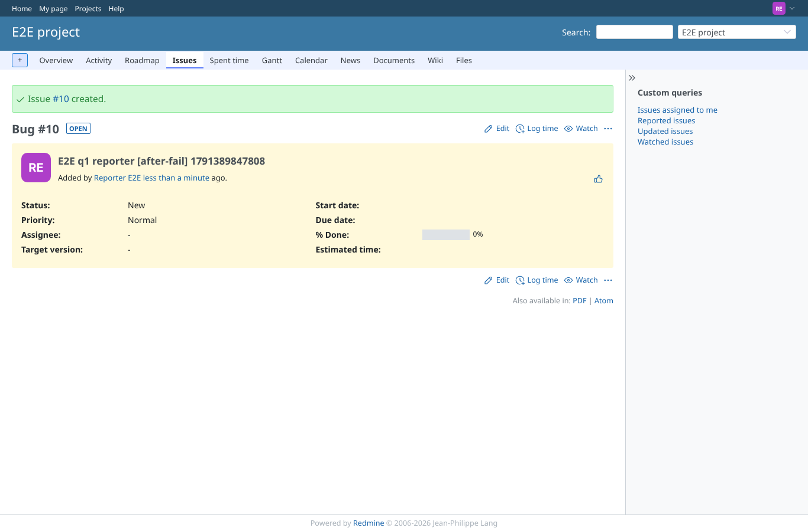
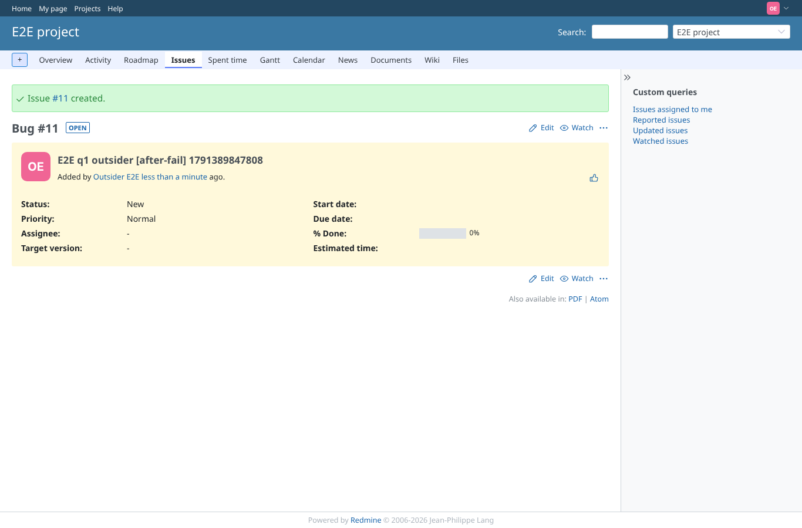
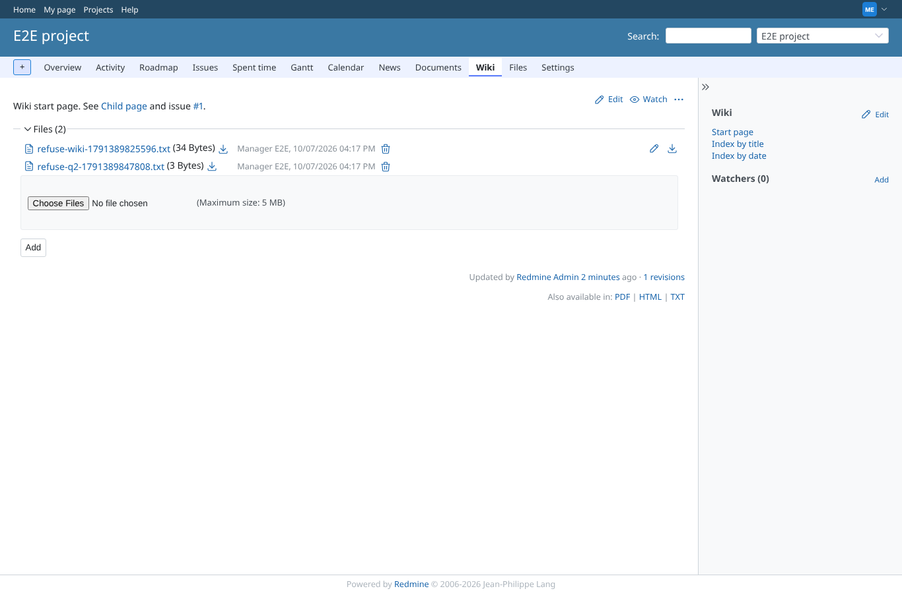
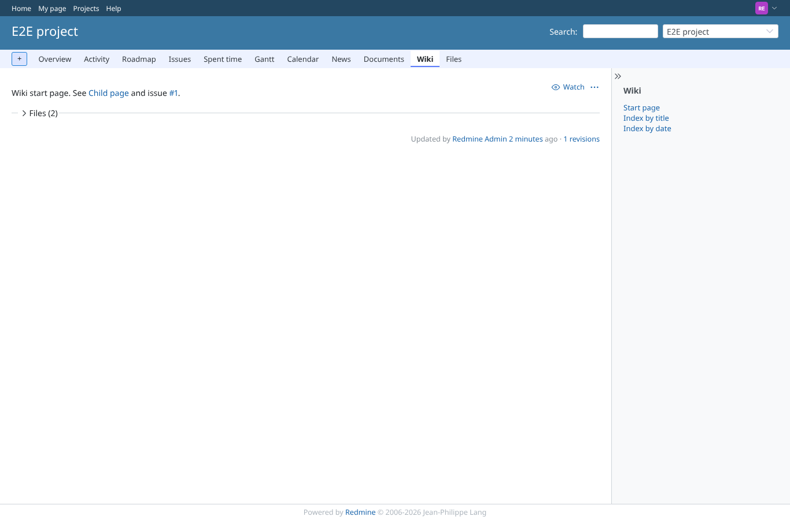

# decisions

Run 2026-10-07T16:17:57.059Z against http://127.0.0.1:3000.

| screenshot | user | URL | shows |
|---|---|---|---|
|  | admin | `/issues/8` | q1 as admin: the after_save script raises, the issue is still created (HTTP 200, notice "Issue #8 created.") |
|  | manager | `/issues/9` | q1 as manager: the after_save script raises, the issue is still created (HTTP 200, notice "Issue #9 created.") |
|  | reporter | `/issues/10` | q1 as reporter: the after_save script raises, the issue is still created (HTTP 200, notice "Issue #10 created.") |
|  | outsider | `/issues/11` | q1 as outsider: the after_save script raises, the issue is still created (HTTP 200, notice "Issue #11 created.") |
|  | outsider | `/projects/e2e-private/issues/new` | Outsider: no issue form in the private project (403), so no workflow runs there |
|  | admin | `/groups/8/edit?tab=users` | q2 as admin: before_add raised for outsider (logged: true) and outsider is added anyway, as documented |
|  | manager | `/groups/8/edit?tab=users` | q2 as manager: group membership is administration only (403) |
|  | reporter | `/groups/8/edit?tab=users` | q2 as reporter: group membership is administration only (403) |
|  | outsider | `/groups/8/edit?tab=users` | q2 as outsider: group membership is administration only (403) |
|  | manager | `/projects/e2e-project/wiki/Wiki` | q2 as manager: the wiki page before_add raised for refuse-*.txt (logged), the file is attached anyway, as documented |
|  | reporter | `/projects/e2e-project/wiki/Wiki` | q2 as reporter: no attach form on the wiki page (no edit permission) |
|  | outsider | `/projects/e2e-private/wiki/Wiki` | q2 as outsider: the private wiki is refused (403) |
