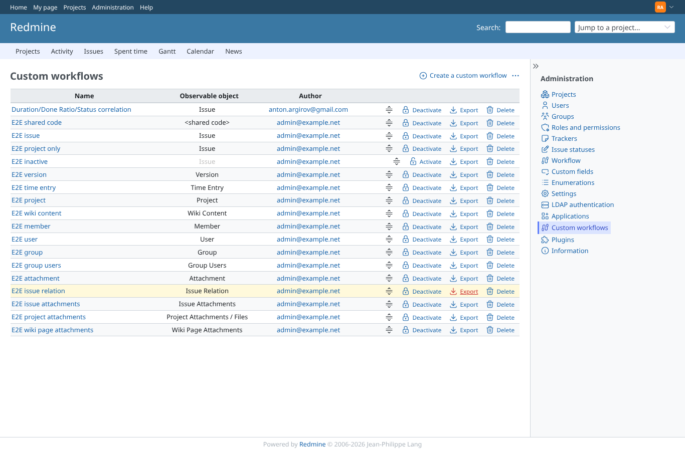
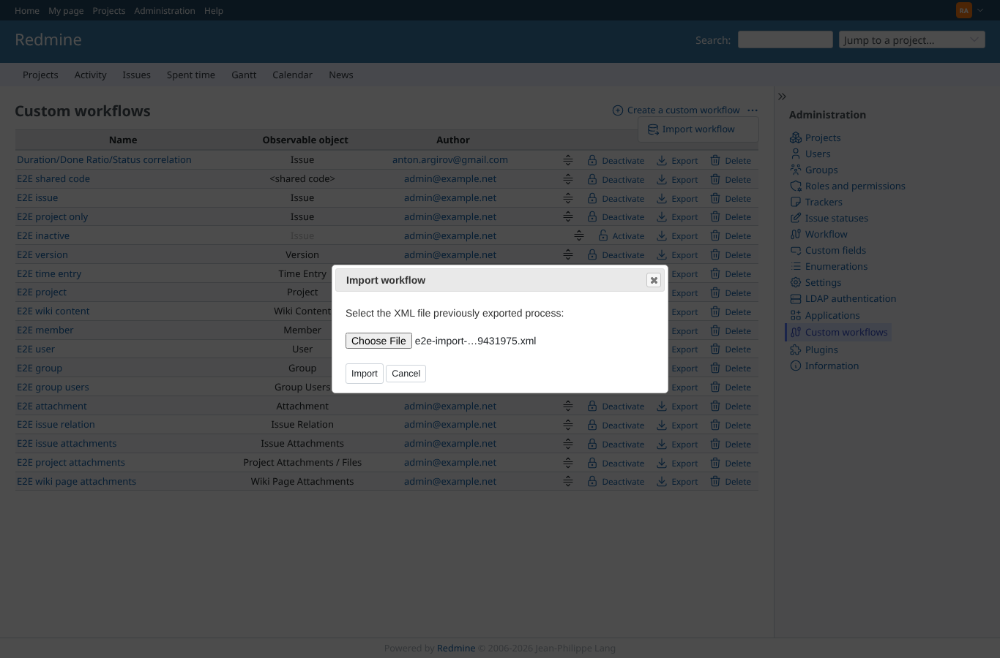
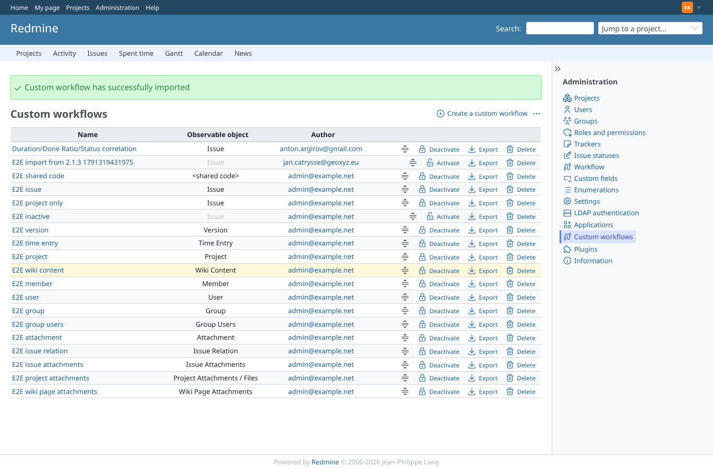
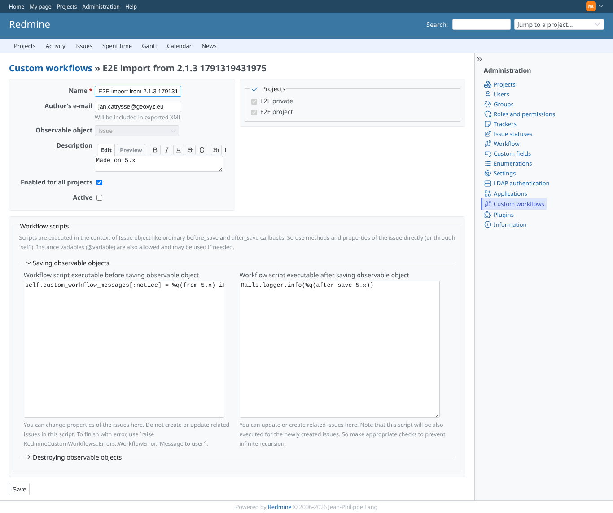
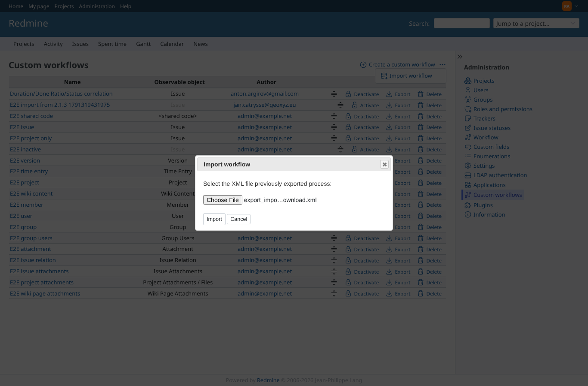
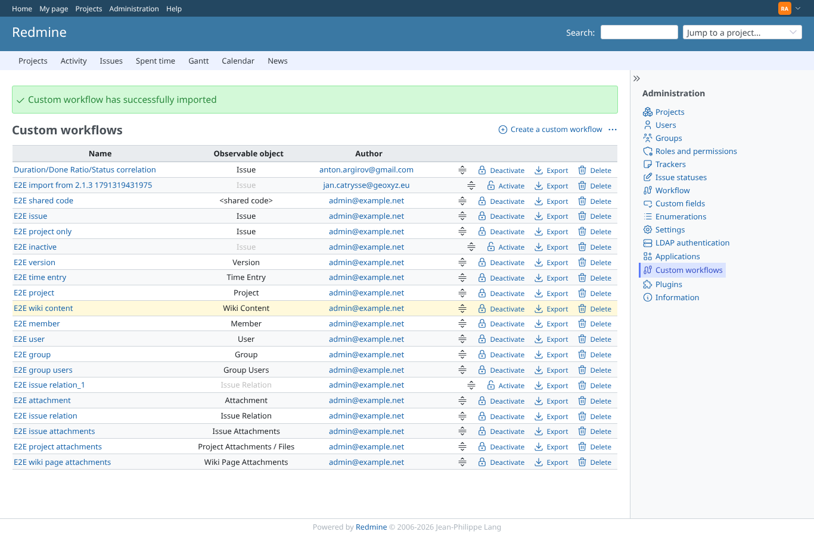
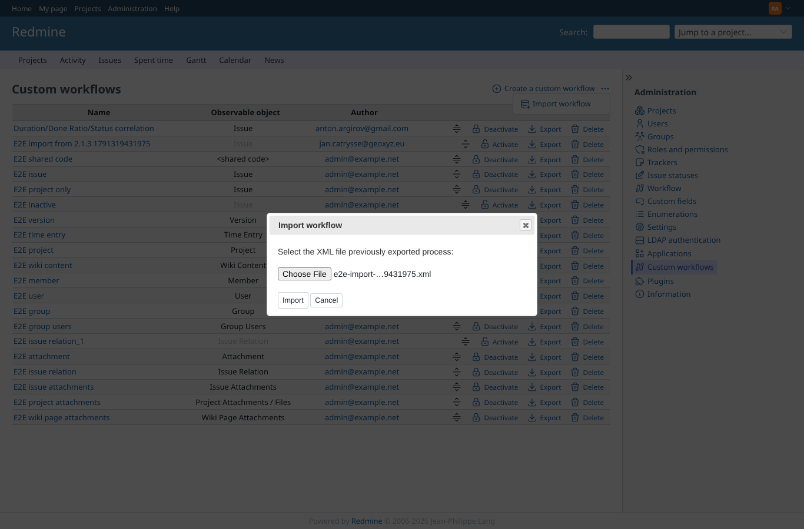
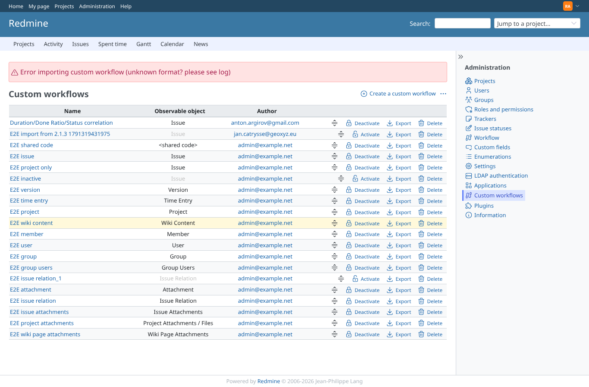
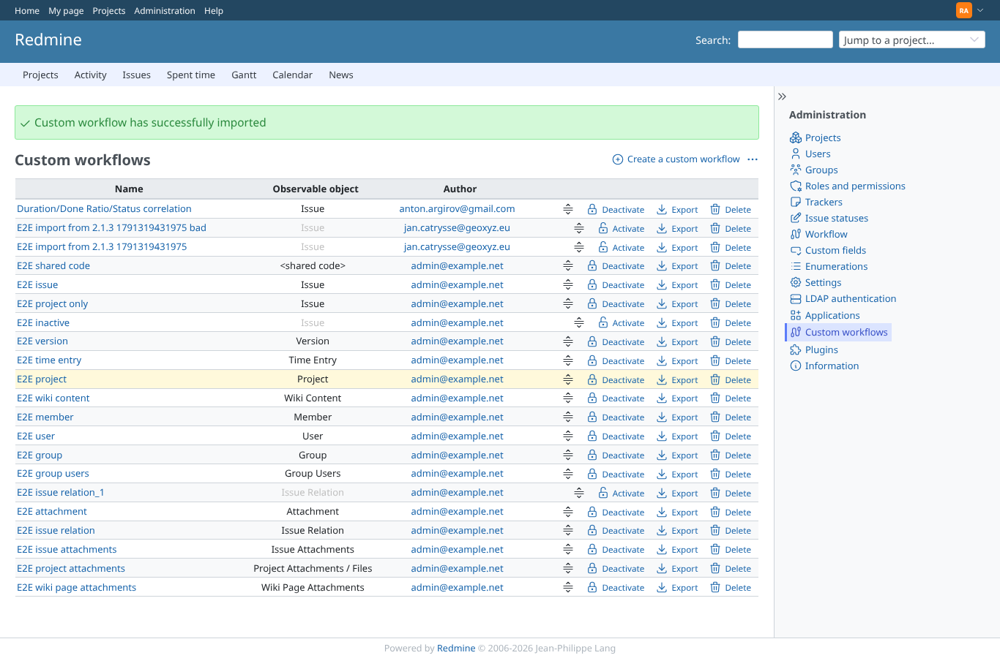

# export_import

Run 2026-10-06T20:44:01.783Z against http://127.0.0.1:3000.

| screenshot | user | URL | shows |
|---|---|---|---|
|  | admin | `/custom_workflows` | Export clicked: "E2E issue relation.xml" downloaded (1227 bytes, saved next to the screenshots) |
|  | admin | `/custom_workflows` | Import dialog with an export made by plugin 2.1.3 on Redmine 5.1 |
|  | admin | `/custom_workflows` | Imported: success notice, the workflow is listed and inactive until an admin activates it |
|  | admin | `/custom_workflows/20/edit` | The imported workflow keeps its scripts, author and description |
|  | admin | `/custom_workflows` | Import dialog with the export just downloaded |
|  | admin | `/custom_workflows` | Re-importing an export of an existing workflow adds a copy named "..._1", inactive |
|  | admin | `/custom_workflows` | Import dialog with a file that is not XML |
|  | admin | `/custom_workflows` | An invalid file is refused with an error, nothing is added |
|  | admin | `/custom_workflows` | Import dialog with a workflow whose script has a syntax error |
|  | admin | `/custom_workflows` | Imported inactive even with a syntax error (scripts are only checked for active workflows) |
|  | manager | `/custom_workflows/1/export` | Export as a non-admin: HTTP 403 |
