# issue_workflows

Run 2026-10-06T20:02:16.737Z against http://127.0.0.1:3000.

| screenshot | user | URL | shows |
|---|---|---|---|
| 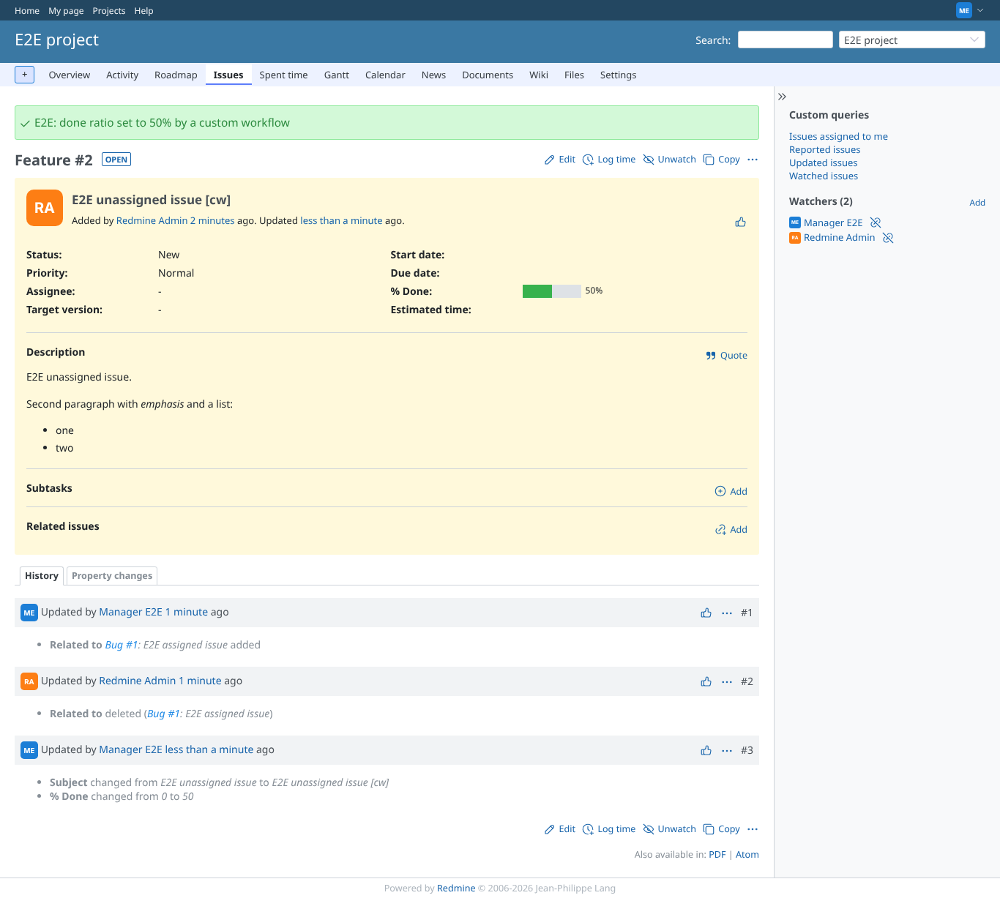 | manager | `/issues/2` | before_save set % Done to 50 and its notice is shown with the core one |
| 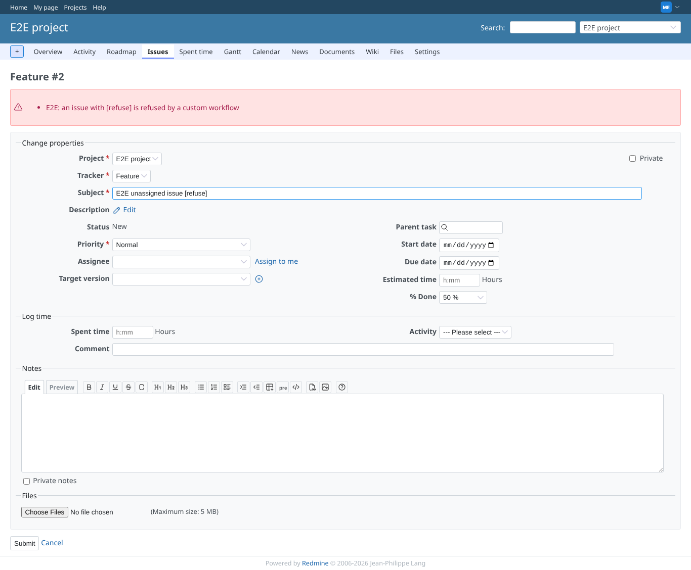 | manager | `/issues/2` | A WorkflowError raised in before_save is shown as a validation error; nothing saved |
| 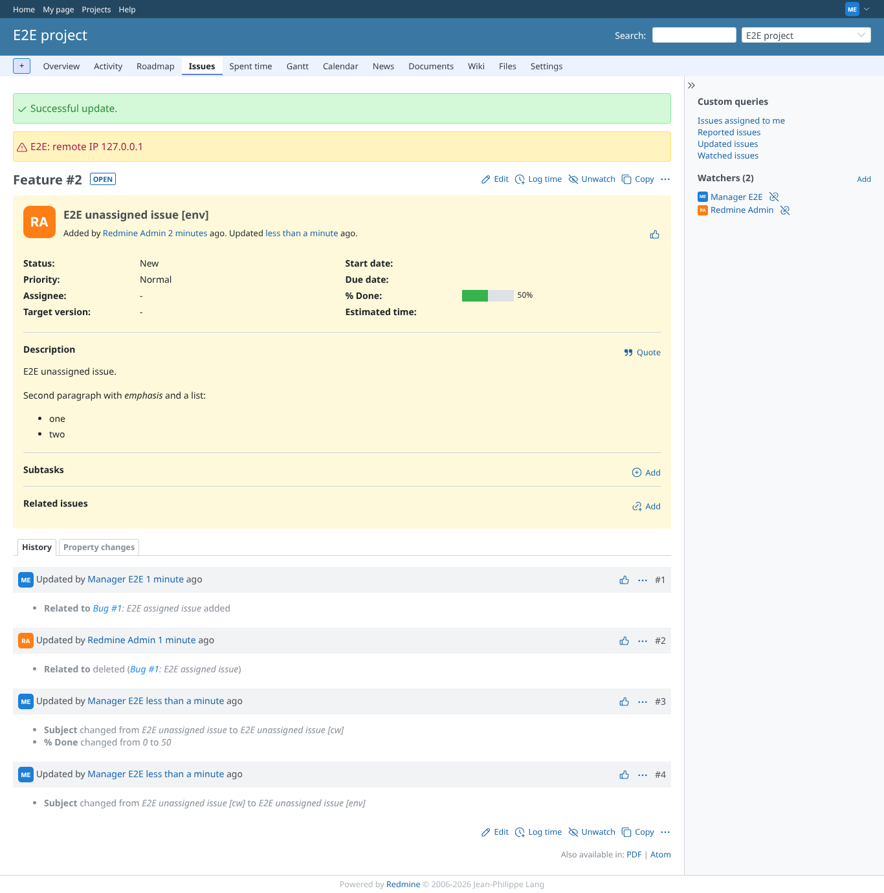 | manager | `/issues/2` | custom_workflow_env[:remote_ip] is filled in by the controller (warning flash) |
| 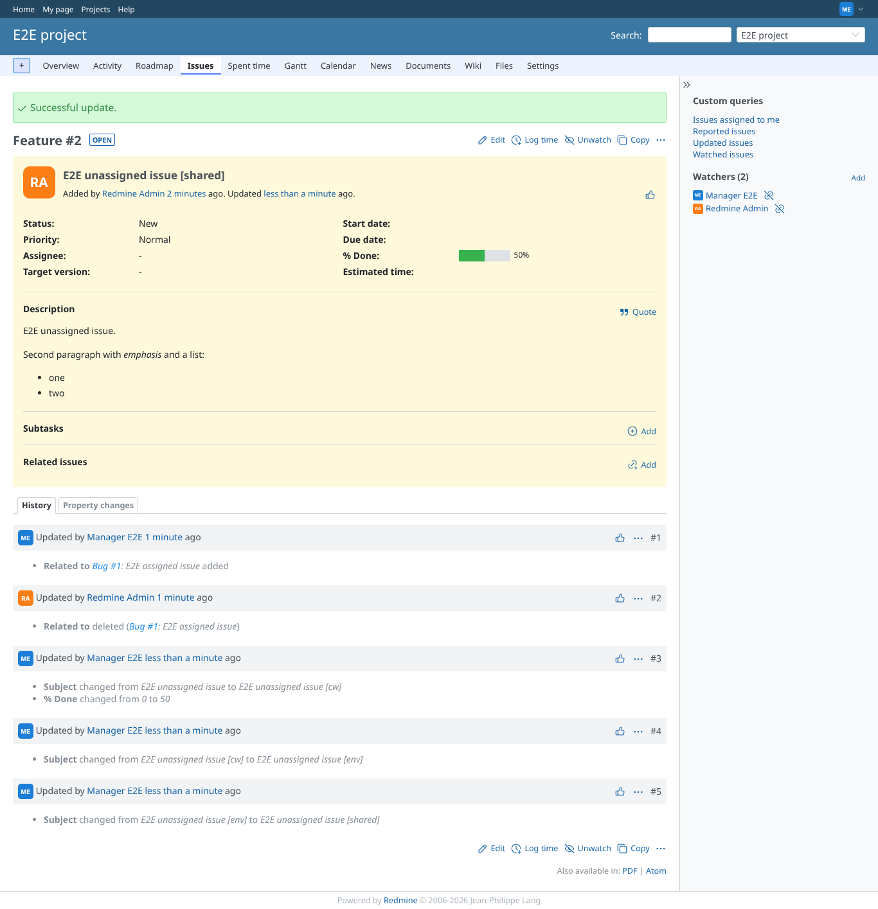 | manager | `/issues/2` | A method defined in the shared code workflow is used by the issue workflow |
| 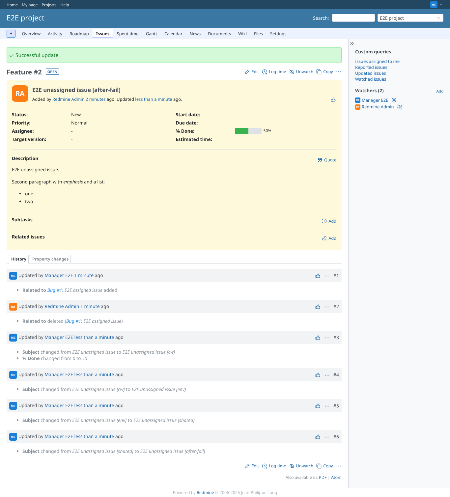 | manager | `/issues/2` | A WorkflowError in after_save no longer gives HTTP 500: the issue is saved (as on 2.1.3) |
| 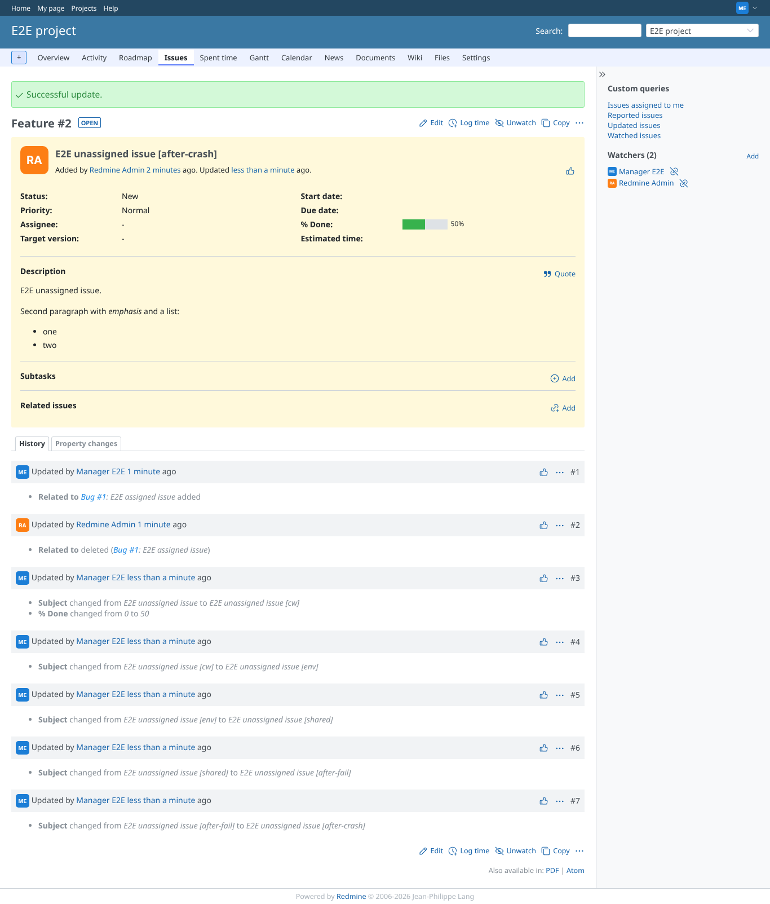 | manager | `/issues/2` | A runtime error in after_save is logged; the issue is saved and the user sees the normal page |
| 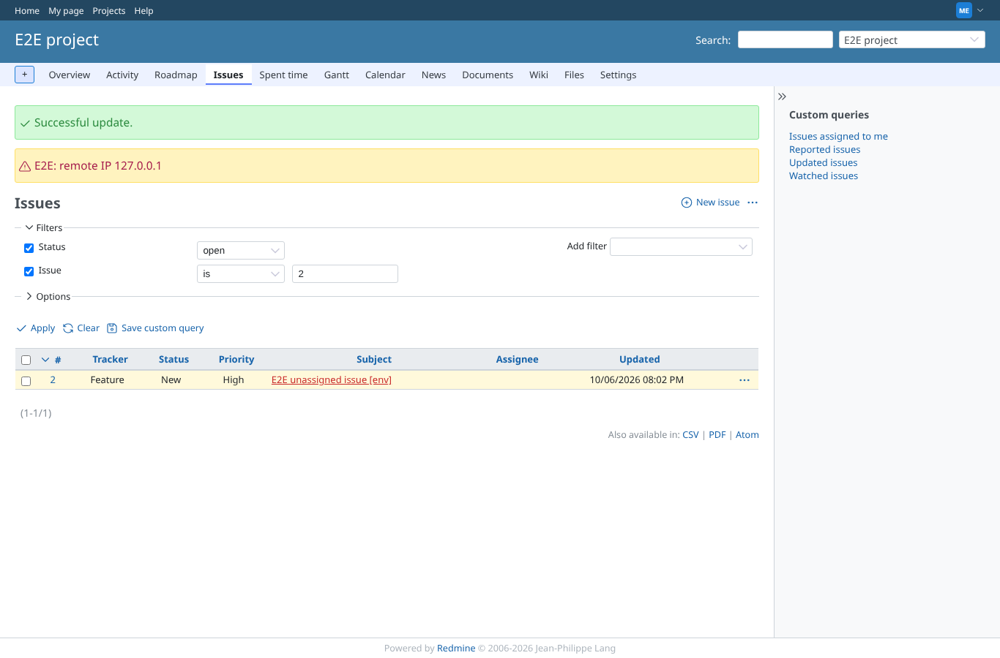 | manager | `/projects/e2e-project/issues?issue_id=2&set_filter=1` | Context menu bulk update (priority High): the workflow runs per issue and its message is shown |
| 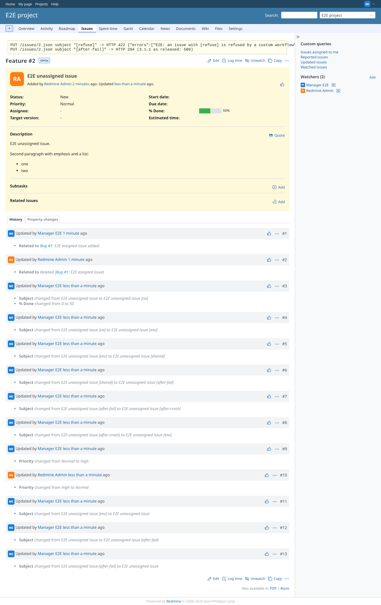 | manager | `/issues/2` | REST API: the refusal is a 422 with the workflow message; a failing after_save is a 204 |
| 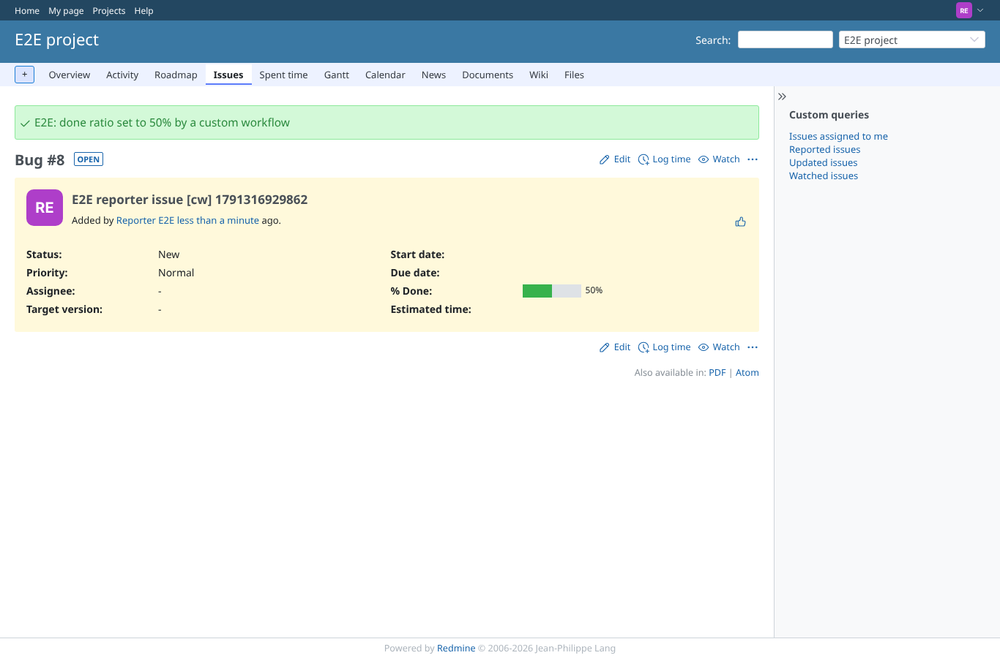 | reporter | `/issues/8` | Reporter (no plugin permission) creates an issue: the workflows run for every user |
| 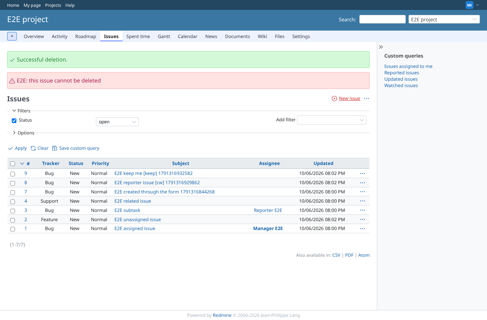 | manager | `/projects/e2e-project/issues` | before_destroy refuses the delete: its error flash is shown and the issue stays (core still adds "Successful deletion", the same on 5.1) |
| 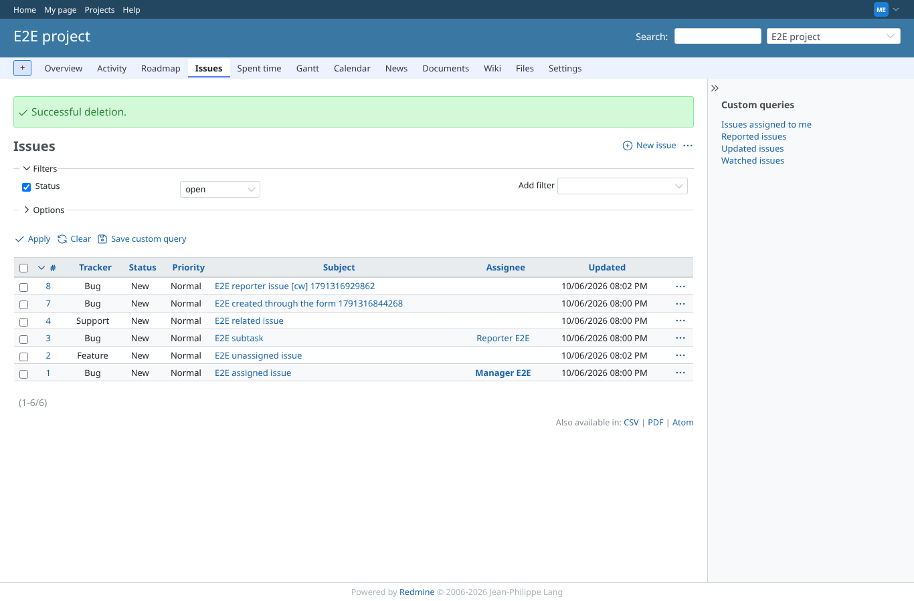 | manager | `/projects/e2e-project/issues` | Without the marker the same issue is deleted |
