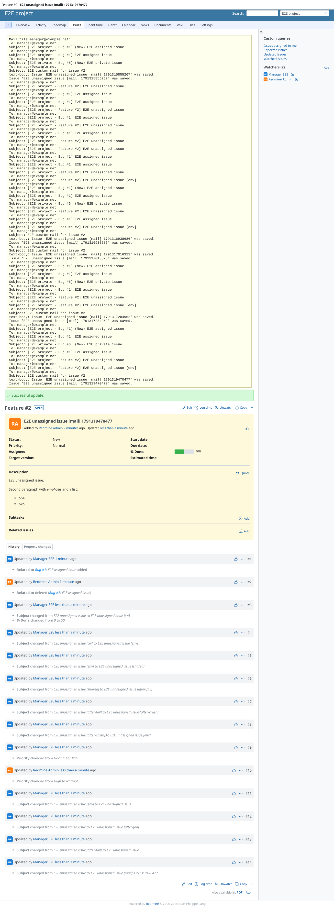
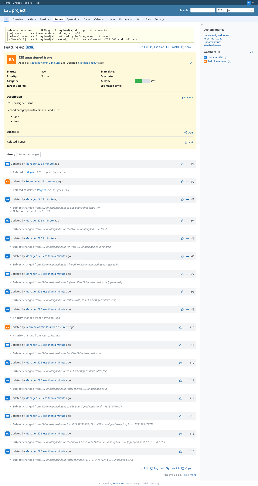
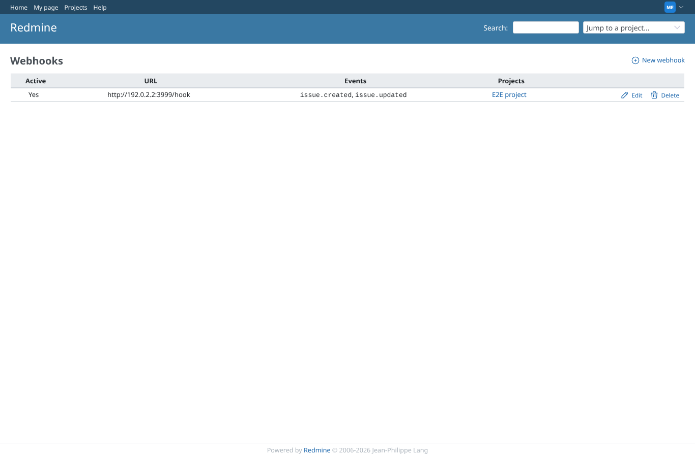

# mail_webhooks

Run 2026-10-06T20:44:42.691Z against http://127.0.0.1:3000.

| screenshot | user | URL | shows |
|---|---|---|---|
|  | manager | `/issues/2` | An after_save script sent a mail with CustomWorkflowMailer (file delivery, recipient and body shown) |
|  | manager | `/issues/2` | Webhooks follow the workflows: the payload has the value set by before_save, a refused save sends nothing |
|  | manager | `/webhooks` | The manager's webhook used here (core Redmine 7, created by the seed; webhooks belong to a user) |
