# observables

Run 2026-10-07T16:19:15.148Z against http://127.0.0.1:3000.

| screenshot | user | URL | shows |
|---|---|---|---|
| 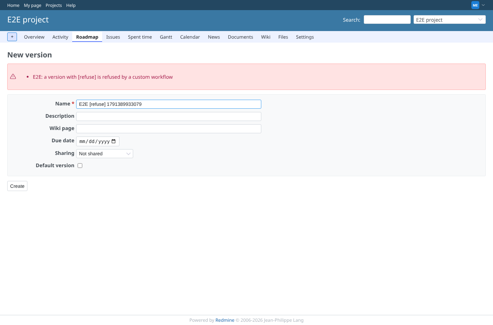 | manager | `/projects/e2e-project/versions` | Version: the workflow refuses a name with [refuse] |
| 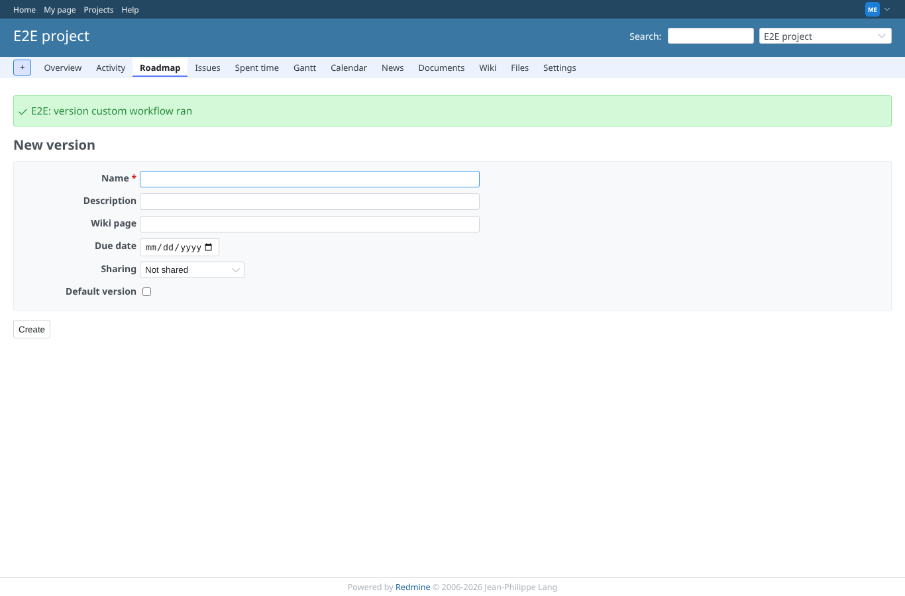 | manager | `/projects/e2e-project/versions/new` | Version: created, with the workflow notice |
| 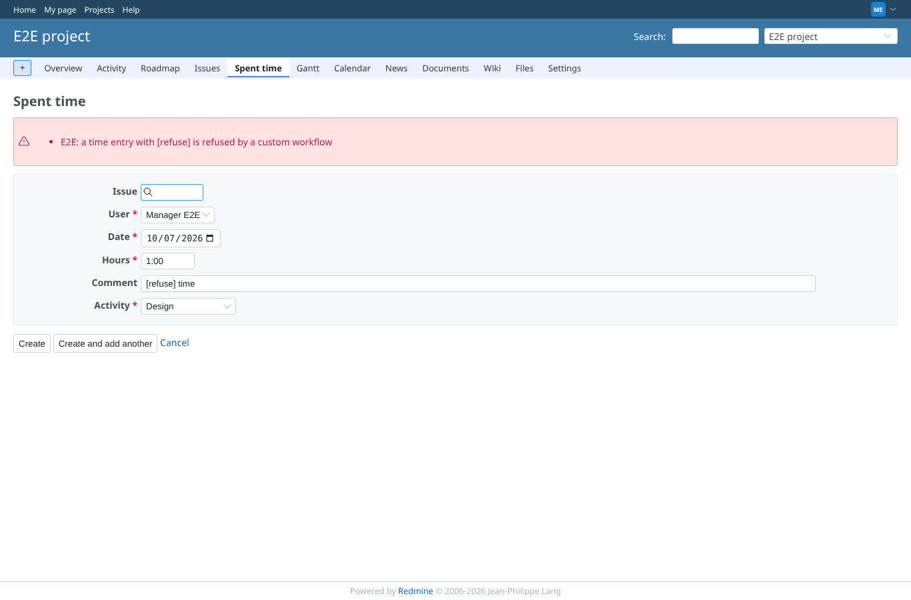 | manager | `/time_entries` | Time entry: refused by its workflow |
| 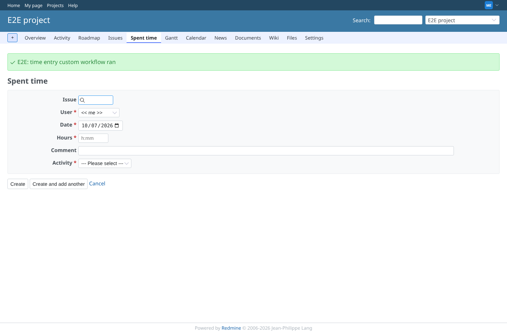 | manager | `/projects/e2e-project/time_entries/new` | Time entry: logged, with the workflow notice |
| 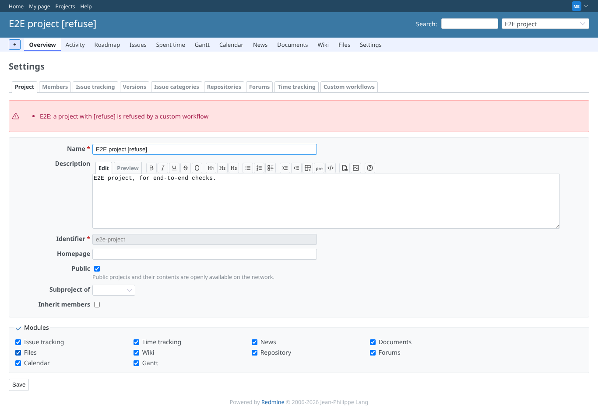 | manager | `/projects/e2e-project` | Project settings: the project workflow refuses the new name |
| 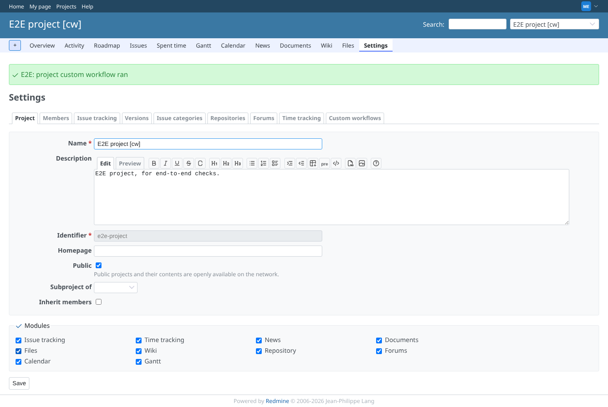 | manager | `/projects/e2e-project/settings` | Project settings: saved, with the workflow notice |
| 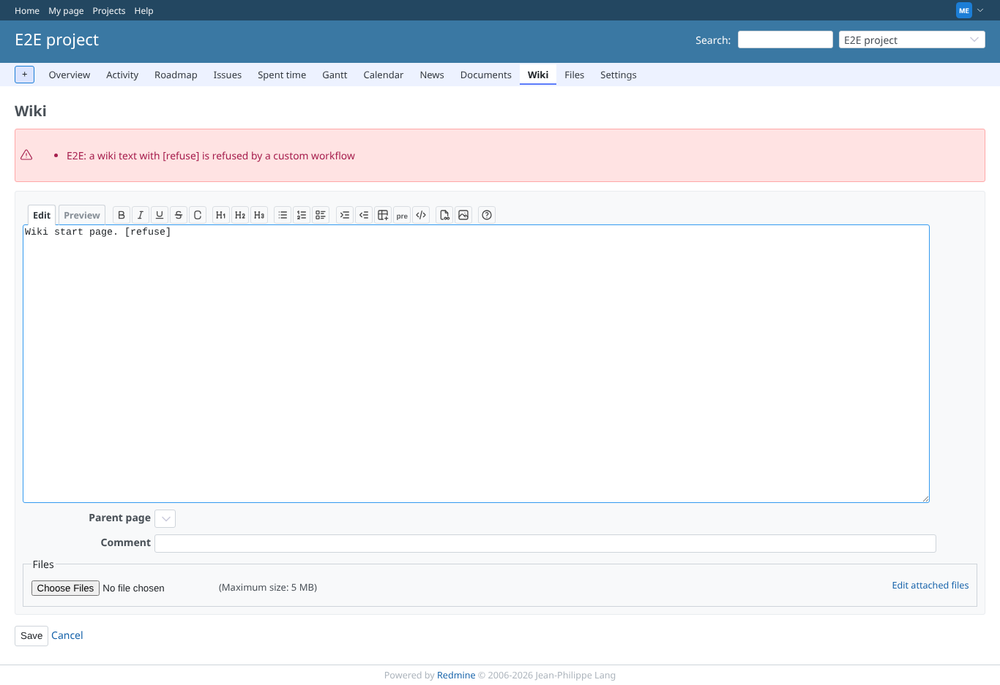 | manager | `/projects/e2e-project/wiki/Wiki` | Wiki: the wiki content workflow refuses the text |
| 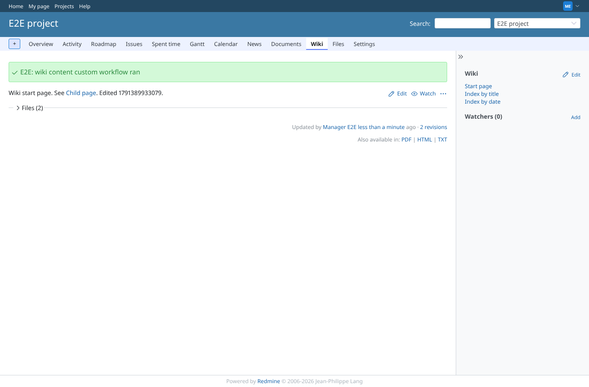 | manager | `/projects/e2e-project/wiki/Wiki` | Wiki: saved, with the workflow notice |
| 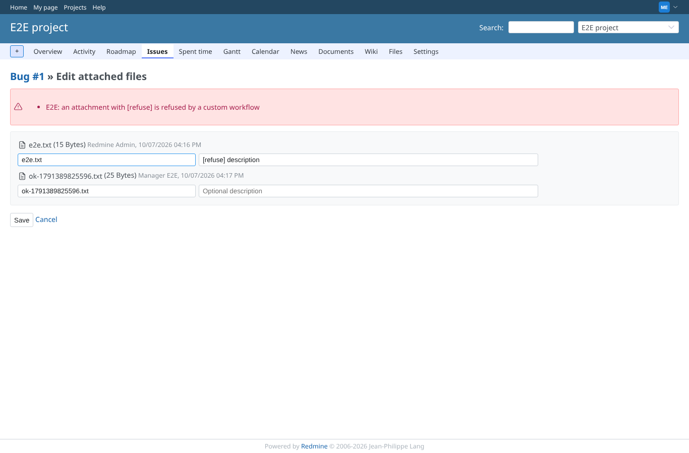 | manager | `/attachments/issues/1` | Attachment: editing a description that the attachment workflow refuses |
| 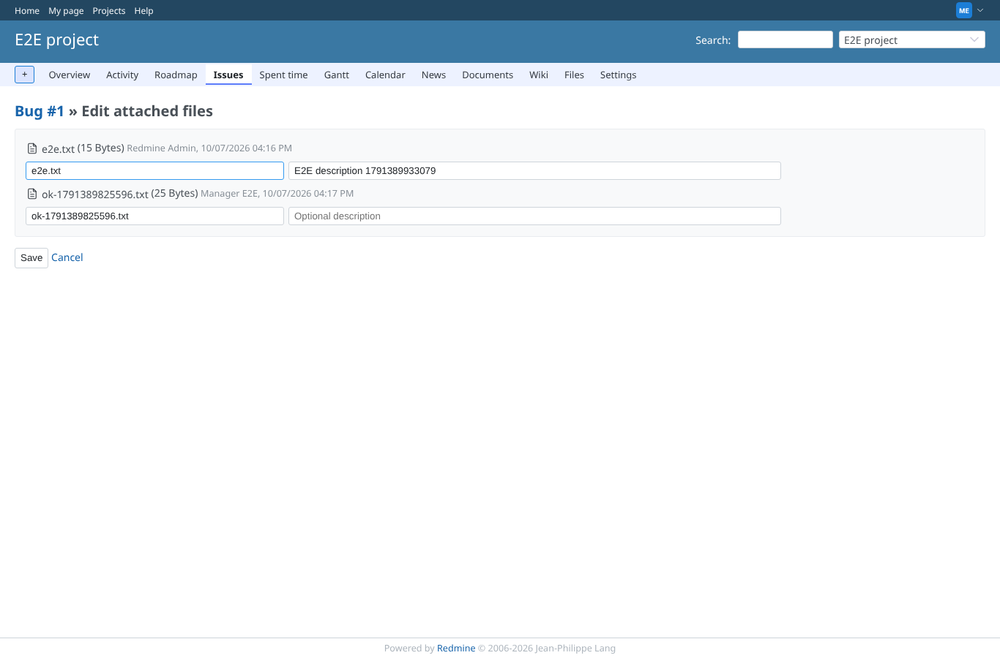 | manager | `/attachments/issues/1/edit` | Attachment: description saved |
| 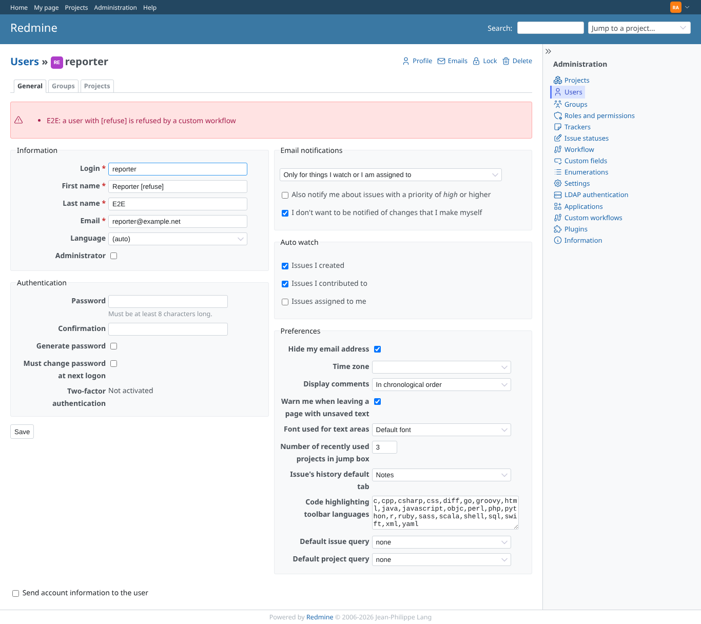 | admin | `/users/6` | User: the user workflow refuses the first name |
| 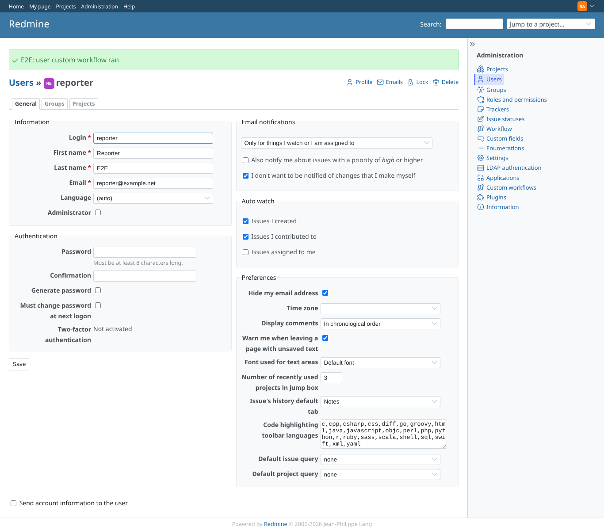 | admin | `/users/6/edit` | User: saved, with the workflow notice |
| 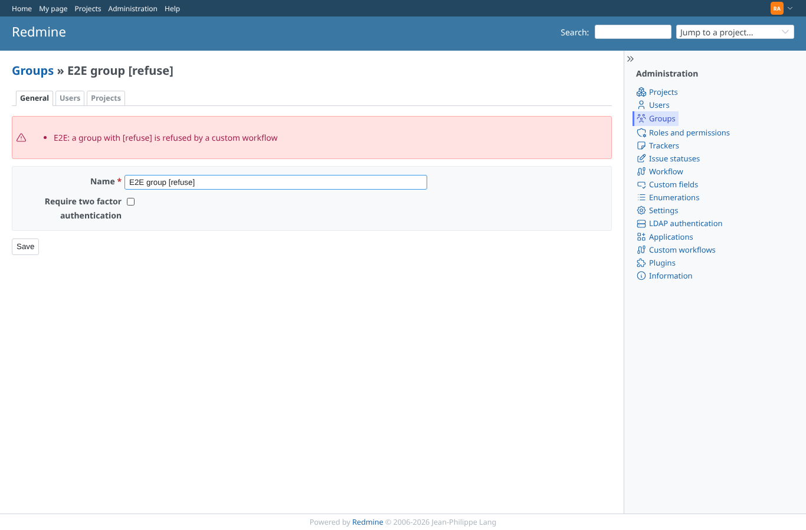 | admin | `/groups/8` | Group: the group workflow refuses the name |
| 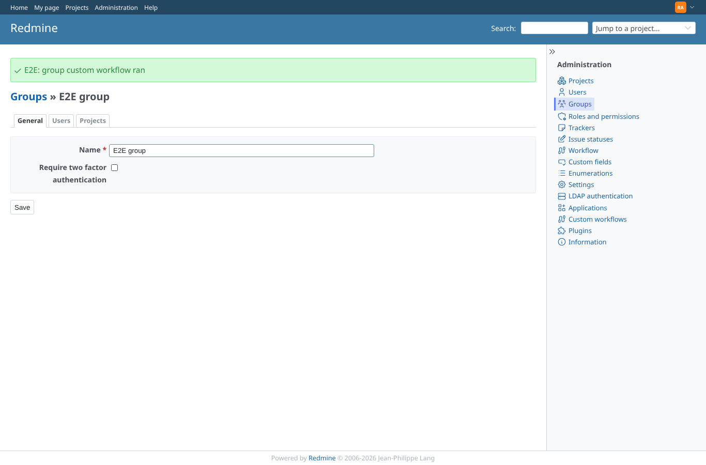 | admin | `/groups/8/edit` | Group: saved, with the workflow notice |
