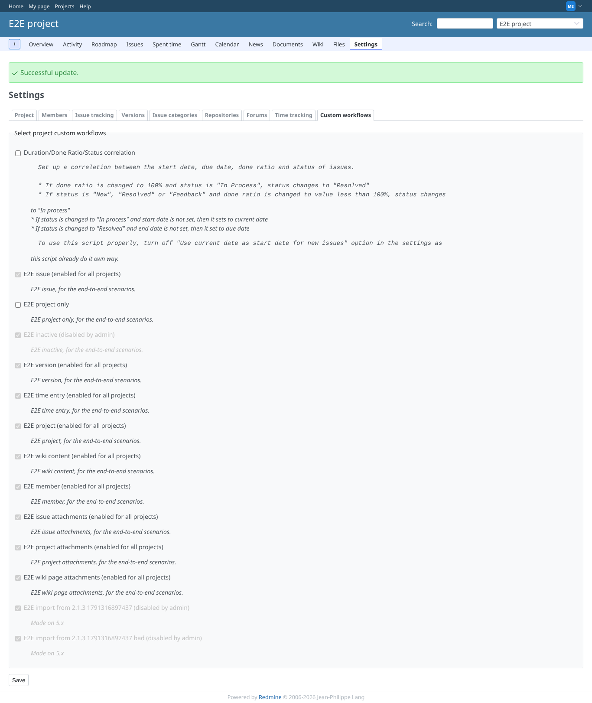
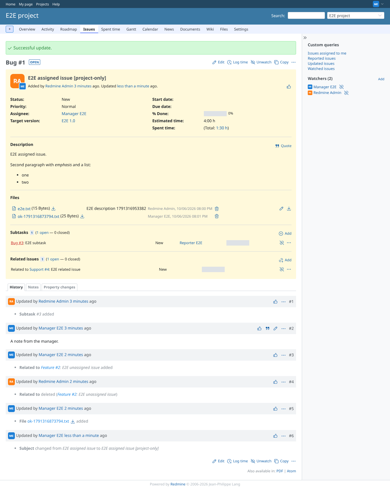
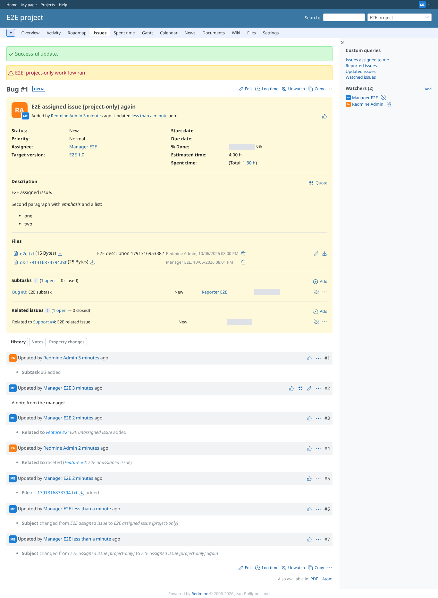
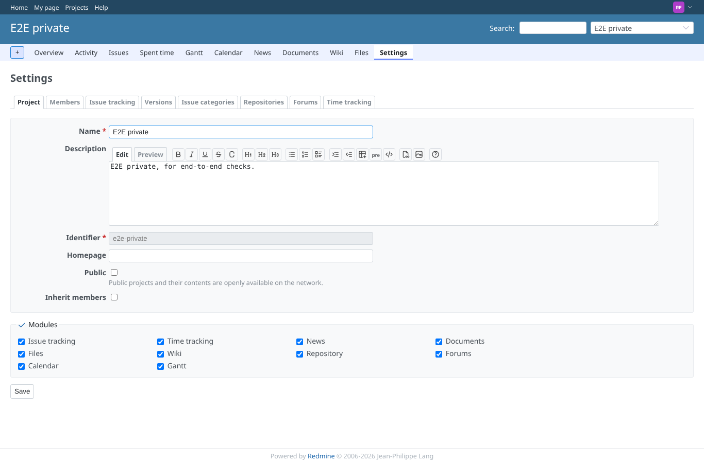
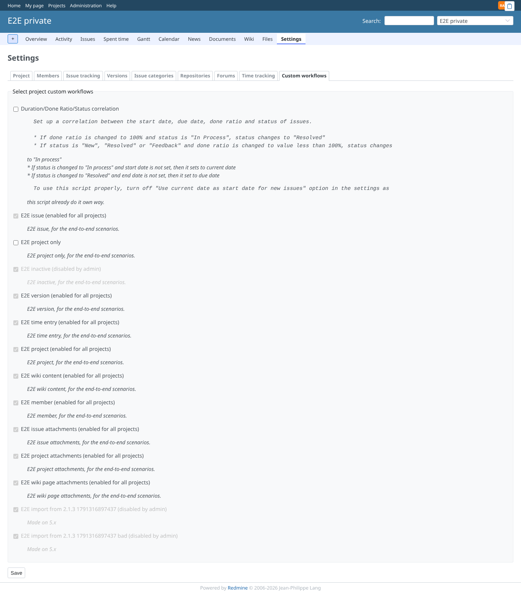

# project_settings

Run 2026-10-06T20:03:14.024Z against http://127.0.0.1:3000.

| screenshot | user | URL | shows |
|---|---|---|---|
|  | manager | `/projects/e2e-project/settings/custom_workflows` | Manager: the tab lists the project workflows; for-all ones checked and locked, the inactive one greyed |
|  | manager | `/issues/1` | Not enabled for this project: saving the issue does not run "E2E project only" |
|  | manager | `/projects/e2e-project/settings/custom_workflows` | Saved: notice, back on the Custom workflows tab, "E2E project only" enabled |
|  | manager | `/issues/1` | Enabled: saving an issue of this project now runs it (warning flash) |
|  | reporter | `/projects/e2e-project/settings/custom_workflows` | Reporter (no project settings permission) is refused |
|  | reporter | `/projects/e2e-private/settings` | With every permission but "Manage project workflows": the settings have no Custom workflows tab |
|  | admin | `/projects/e2e-private/settings/custom_workflows` | A forged custom_workflow_ids from that user was ignored: nothing enabled for e2e-private |
|  | outsider | `/projects/e2e-private/settings/custom_workflows` | A non-member is refused the private project |
